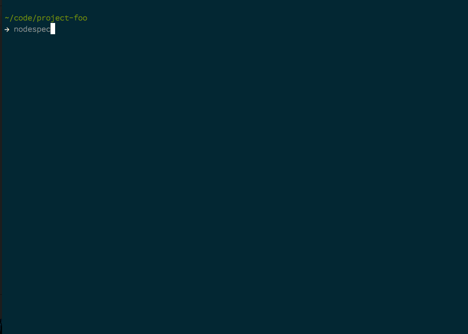

#Nodespec

[](http://travis-ci.org/mike182uk/nodespec)
[](https://codeclimate.com/github/mike182uk/nodespec)

A tool to help drive emergent design by specification in Node.JS

Inspired by [PHPSpec](http://www.phpspec.net/). See [here](http://www.phpspec.net/en/latest/manual/introduction.html) for a good intro into Spec BDD :)

**Project still in development, see the issue tracker for bugs, feature requests etc.**



##Installation

```bash
npm install nodespec --save-dev 
```

##Usage

To initialize Nodespec in your project run:

```bash
nodespec init
```

This will generate a Nodespec config file for you (`nodespec.json`).

Once you have initialized Nodespec you can describe an object:

```bash
nodespec describe Foo
```

This will generate a spec for the object `Foo`. You can now start describing your objects behavior in the spec.

You can also describe an object using the describe alias (`desc`):

```
nodespec desc Foo
```

Once you have described your objects behavior you can then run the spec:

```bash
nodespec run
```

Before Nodespec runs the specs it will check that a corresponding source file exists for a spec. If a source file for a spec does not exist it will prompt you to create it. If you answer `y` Nodespec will generate the source file in the appropriate location. After Nodespec has done checking for non-existent source files it will run the spec runner (currently [jasmine](https://jasmine.github.io)).

###Describing namespaced objects

You can describe a namespaced object:

```
nodespec describe Foo/Bar/Baz
```

This will create a spec at `<specPath>/Foo/Bar/Baz<specSuffix>.js` and a source file at `<srcPath>/Foo/Bar/Baz.js`.

###Running a spec for a single object

When you run `nodespec run` all the specs for your project are run. You can run a single spec by passing one of following arguments to `nodespec run`:
- the name of the object: `nodespec run Foo`
- the relative path to the spec: `nodespec run spec/FooSpec.js`
- the absolute path to the spec `nodespec run ~/code/project/spec/FooSpec.js`

##Configuration

When you run `nodespec init` a Nodespec config (`nodespec.json`) file will be generated in your project. The config options available to you are:

- **specPath**: relative path to your specs
- **srcPath**: relative path to your source code
- **specSuffix**: suffix to be applied to any generated spec files
- **runner**: spec runner config (see [jasmine config](https://jasmine.github.io/2.3/node.html#section-9))
